# Práctica 1 - Fernando Flores Garrido
## Paso 1: Instalación de Ubuntu Server
Instalamos Ubuntu Server en dos máquinas virtuales a la vez, instalando a su vez los servicios de SSH y LAMP en la instalación del SO.

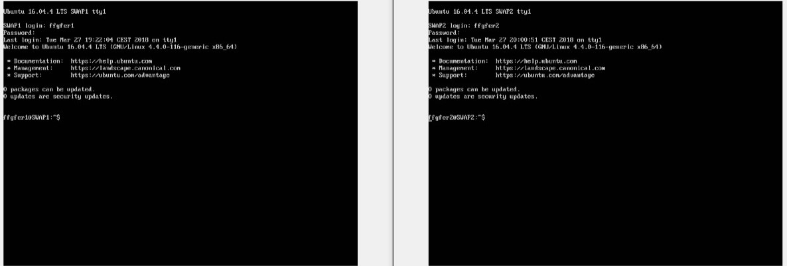

## Paso 2: Configuración de red
Simulamos que nuestras máquinas se encuentran en una misma red NAT que nosotros creamos con virtualbox, adicionalmente también añadimos una tarjeta de red host-only para facilitar posibles tareas futuras, para poder acceder desde nuestro navegador en el sistema anfitrión al servidor web virtualizado.

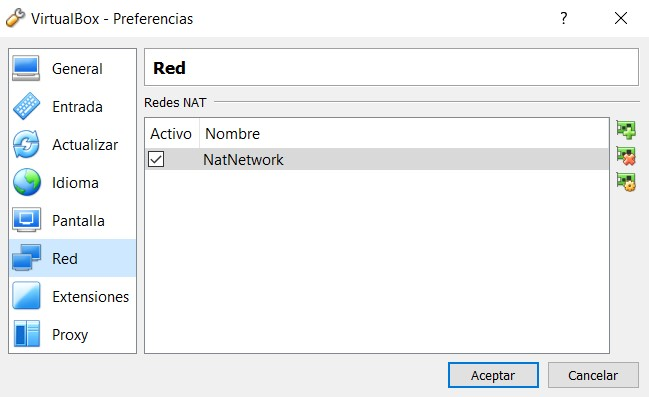

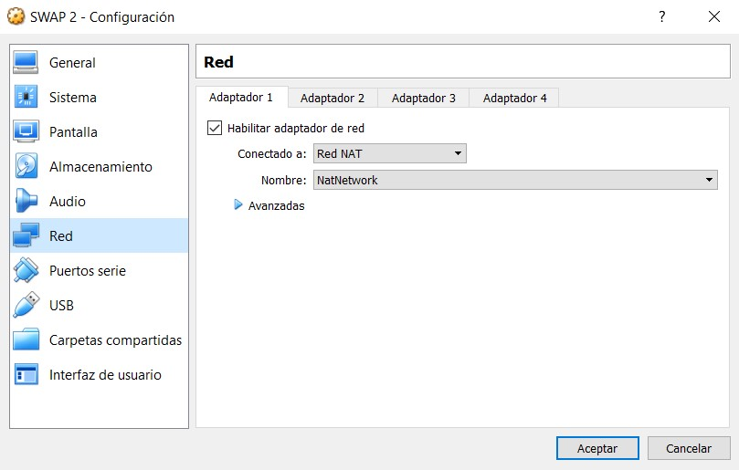

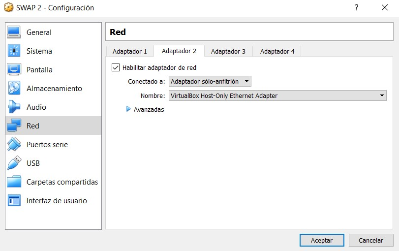

## Paso 3:  Comprobando que el servidor web funciona correctamente
Seguimos el consejo que se indica en el guión y comprobamos tanto la versión de apache como si está funcionando:
> apache2 -v
> ps aux | grep apache

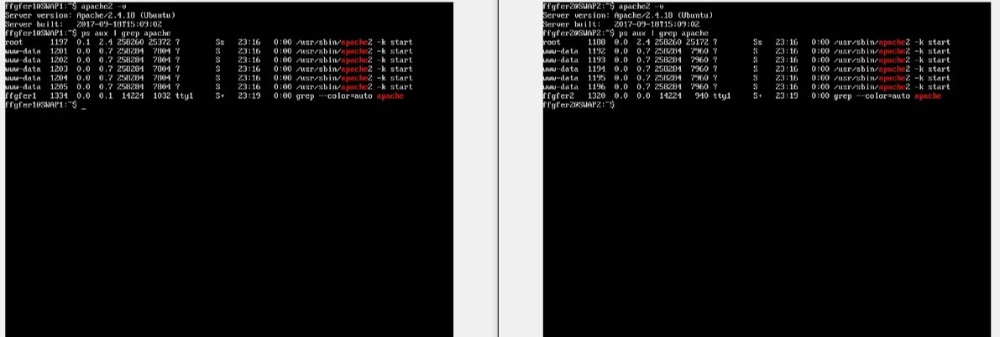

## Paso 4: Instalación de curl
Como se muestra en la siguiente imagen, curl ya está instalado por defecto en la distribución de Ubuntu Server que hemos utilizado:
> sudo apt-get install curl

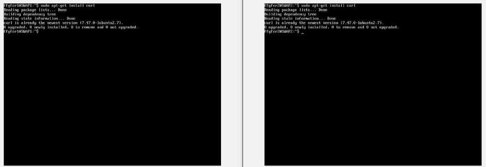

## Paso 5: Configuración de la tarjeta de red host-only
Configuramos la tarjeta que como hemos comentado antes, nos facilitará el acceso a nuestro servidor web desde el sistema anfitrión de las máquinas virtuales, aunque no es necesario para conseguir la conexión SSH y mediante curl como veremos más adelante dado que con la conexión por la propia red NAT esto ya es posible:
> sudo nano /etc/network/interfaces

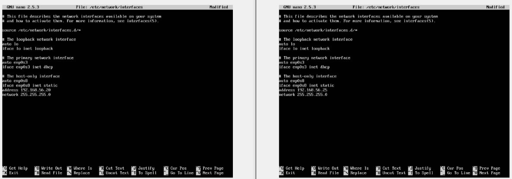

> sudo /etc/init,d/networking restart

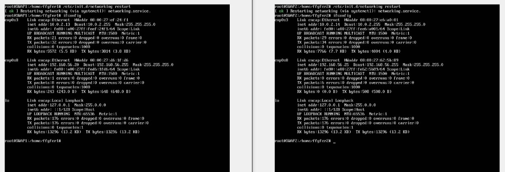

## Paso 6: Creamos archivo hola.html en ambas máquinas:
> sudo nano /var/www/html/hola.html

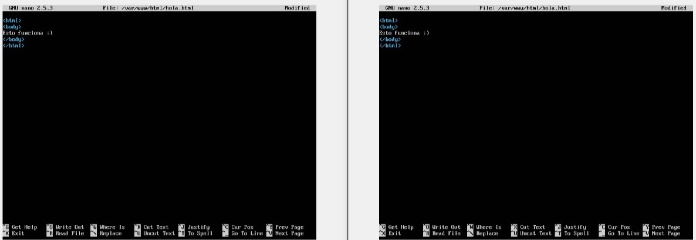

# Resultados:
## 1. Conexión mediante SSH:
> ssh usuario@IP

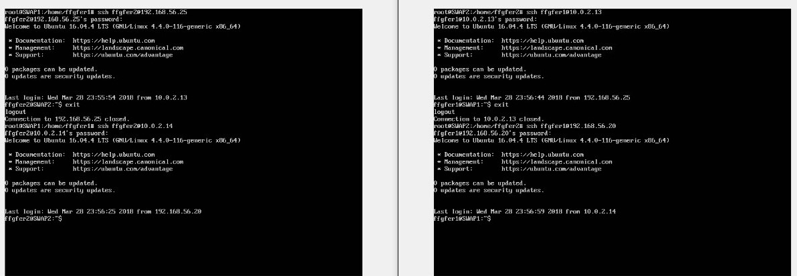

## 2. Conexión al servidor web de la otra máquina mediante curl:
> curl IP/rutaalarchivo

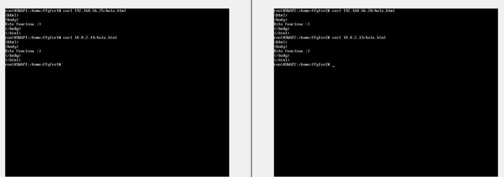

