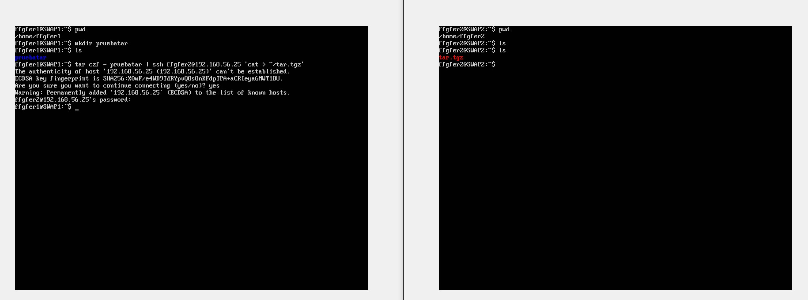
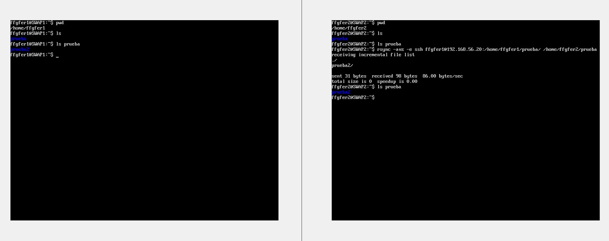
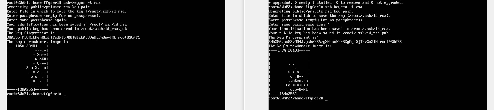
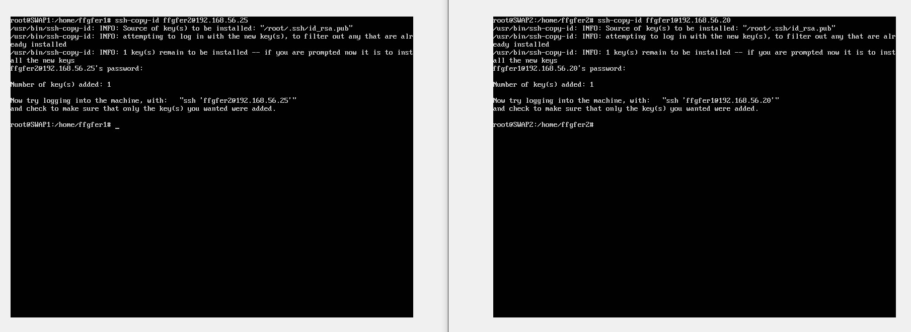
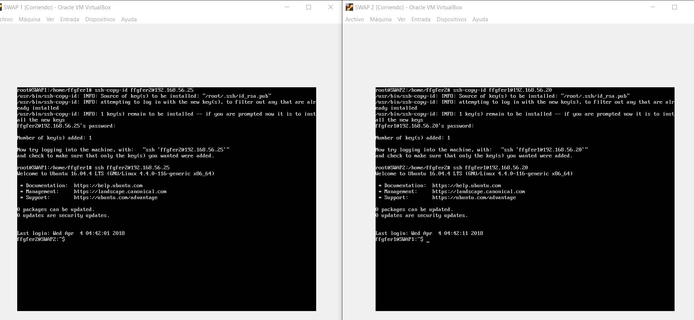
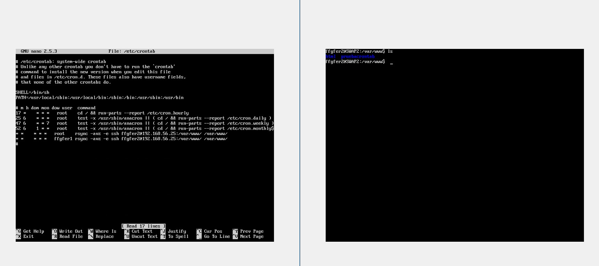
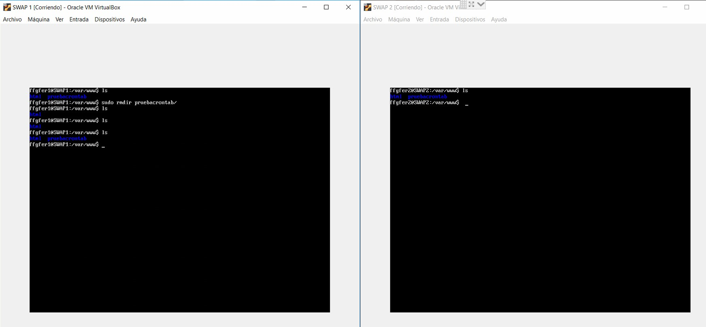

# Práctica 2 - Fernando Flores Garrido
## Paso 1: Probamos el funcionamiento de la copia de archivos mediante ssh

> tar -czf - directorio | ssh usuario@IPMáquinaRemota 'cat > ~/nombrearchivo'



## Paso 2:  Uso de rsync (se omite la instalación, la cual viene indicada en el guión, dado que este ya viene instalado por defecto en Ubuntu Server)
Como podremos observar en la siguiente imagen, una vez se ejecuta rsync la carpeta prueba2, dentro de la carpeta prueba, la cual ya ha sido creada previamente en la máquina SWAP1, durante la sincronización esta es clonada en la máquina SWAP2.

>rsync -avz -e ssh usuario@IPMáquinaRemota:RutaDirectorioRemoto RutaDirectorioMáquinaSincronizada




## Paso 3: Eliminamos la necesidad de introducir la contraseña cada vez que hagamos ssh a otra máquina
>ssh-keygen -t rsa (en este caso nos hemos decantado por una clave rsa)



>ssh-copy-id usuario@IPMáquinaRemota



A continuación, se demuestra como después de ejecutar el comando ssh-copy-id tal y como se ha indicado, podemos hacer ssh sin que se nos requiera contraseña. (Nota: este paso se ha repetido con el usuario root, para que desde este usuario también se pueda acceder a las máquinas remotas igualmente).




## Paso 4: Configuración de crontab para que se sincronice la carpeta /var/www/ entre las dos máquinas
Configuramos de la siguiente manera el archivo crontab

> nano /etc/crontab



Podemos observar como pasado tras pasado un tiempo, aparece nuestro directorio de prueba en la máquina que ejecuta la orden rsync una vez por minuto (tal y como habíamos indicado en el archivo /etc/crontab)






