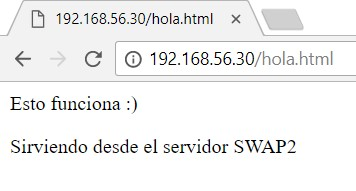

# Práctica 1 - Fernando Flores Garrido
## Paso 1: Modificación del código del archivo hola.html para poder diferenciar las máquinas cuando probemos los balanceadores.
> nano /var/www/html/hola.html



# NginX

## - Configuración de red de la máquina que usaremos para el paso 2.



## Paso 2.1: Instalación de NginX en una máquina preconfigurada sin servidor LAMP.
> apt-get install nginx




## Paso 2.2: Puesta a punto de la configuración de NginX para funcionar con el algoritmo de balanceo round-robin.
> nano /etc/nginx/conf.d/default.conf



> nano /etc/nginx/nginx.conf



> systemctl restart nginx (para aplicar los cambios efectuados en la configuración)




## Paso 2.3: Prueba de funcionamiento del balanceador.




## Paso 2.4: Puesta a punto de la configuración de NginX para funcionar con el algoritmo de balanceo con ponderación.
Habría que configurar los archivos de manera similar que en el paso 2.2, salvo una ligera diferencia en el archivo /etc/nginx/conf.d/default.conf (concretamente en la sección upstream)
> nano /etc/nginx/conf.d/default.conf



> systemctl restart nginx (para aplicar los cambios efectuados en la configuración)




# HaProxy

## - Configuración de red de la máquina que usaremos para el paso 3.



## Paso 3.1: Instalación de HaProxy en una máquina preconfigurada sin servidor LAMP.
> apt-get install haproxy




## Paso 3.2: Puesta a punto de la configuración de HaProxy para funcionar con el algoritmo de balanceo round-robin.
> nano /etc/haproxy/haproxy.cfg



> /usr/sbin/haproxy -f /etc/haproxy/haproxy.cfg




## Paso 3.3: Prueba de funcionamiento del balanceador.




## Paso 3.4: Puesta a punto de la configuración de HaProxy para funcionar con el algoritmo de balanceo con ponderación.
Habría que configurar el  archivo haproxy.cfg de manera similar que en el paso 3.2, salvo una ligera diferencia al final del archivo.
> nano /etc/haproxy/haproxy.cfg



> /etc/init.d/haproxy reload




## Paso 4.1: Instalación de ApacheBench.
> apt-get install apache2-utils



## Paso 4.2: Recogida de 2 muestras (con diferente número de peticiones y nivel de concurrencia) por cada balanceador.
> ab -n num_peticiones -c nivel_concurrencia http://IPMáquina/archivo







Como se aprecia en las imágenes, el tiempo medio de servicio del balanceador haproxy es menor que el del balanceador nginx, tanto cuando el número de peticiones es 10000 y el nivel de concurrencia es 10, como cuando el número de peticiones ese 50000 y el nivel de concurrencia es 50.






