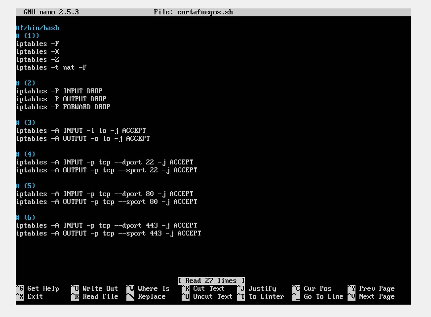

# Práctica 4 - Fernando Flores Garrido
## Tarea 1: Configuración de certificado SSL autofirmado para permitir el acceso mediante HTTPS

## Paso 1. Configuración de la máquina 1
## Paso 1.1. Ejecutamos los siguientes comandos:
> a2enmod ssl

> service apache2 restart

> mkdir /etc/apache2/ssl

> openssl req -x509 -nodes -days 365 -newkey rsa:2048 -keyout /etc/apache2/ssl/apache.key -out /etc/apache2/ssl/apache.crt



## Paso 1.2. Modificamos el archivo /etc/apache2/sites-available/default-ssl.conf
> nano /etc/apache2/sites-available/default-ssl.conf



## Paso 1.3. Activamos la nueva configuración:
> a2ensite default-ssl

>service apache2 reload



## Paso 1.4. Comprobamos que funciona:


Como se puede ver, con la otra máquina configurada con un servidor apache no funciona el acceso mediante HTTPS



## Paso 2. Copiamos el certificado SSL a la máquina 2.
## Paso 2.1. Ejecutamos los siguientes comandos:
> a2enmod ssl

> service apache2 restart



## Paso 2.2. Copia de archivos mediante rsync:
> rsync -avz -e ssh usuario@IPMáquina:/etc/apache2/ssl/* /etc/apache2/ssl && rsync -avz -e ssh usuario@IPMáquina:/etc/apache2/sites-available/default-ssl.conf /etc/apache2/sites-available/default-ssl.conf

Nota: en la imagen ssh nos pide contraseña porque  tras realizar la práctica 2, perdí esas máquinas y tuve que realizar la práctica 3 empezando con las máquinas guardadas en la práctica 1.



## Paso 2.3. Activamos la nueva configuración:
> a2ensite default-ssl

>service apache2 reload



## Paso 2.4. Comprobamos que funciona:


## Paso 3. Copiamos el certificado SSL a la máquina 3 (balanceador con nginx)
## Paso 3.1. Ejecutamos los siguientes comandos y hacemos uso de rsync para copiar el certificado:
> mkdir /etc/nginx/ssl

> rsync -avz -e ssh Usuario@IPMáquina:/etc/apache2/ssl/* /etc/nginx/ssl/



## Paso 3.2. Modificamos el archivo /etc/nginx/conf.d/default.conf
> nano /etc/nginx/conf.d/default.conf

Añadimos las siguientes líneas:
listen 443 ssl;
ssl on;
ssl_certificate /etc/nginx/ssl/apache.crt;
ssl_certificate_key /etc/nginx/ssl/apache.key;



## Paso 3.3. Reiniciamos nginx para aplicar la nueva configuración:
> service nginx restart



## Paso 3.4. Comprobamos que funciona:



## Tarea 2: Configuración del cortafuegos en la máquina 1.
## Paso 1. Creamos dos scripts, uno que desactive el cortafuegos (nocortafuegos.sh) y otro que lo configure correctamente (cortafuegos.sh).





Paso 2: Comprobamos que el cortafuegos funciona como debería con los siguientes comandos.
> iptables -L -n -v

> netstat -tulpn



Paso 3: Configuramos el archivo crontab para que el cortafuegos se configure correctamente después de cada reinicio del sistema.
> nano /etc/crontab








