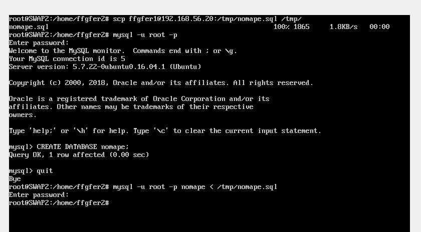

# Práctica 5 - Fernando Flores Garrido

## Paso 1: Crear una BD con al menos una tabla y algunos datos.
- Entramos en mysql con el usuario root y la contraseña que hubiéramos configurado (en nuestro caso, en la práctica 1 durante la configuración inicial de las máquinas y la instalación del sistema operativo):
> mysql -uroot -p

- Introducimos los siguientes comandos para crear una base de datos con una tabla y un registro de datos:
 
> create database nombredb;

> use nombredb;

> create tabla nombretabla(atributo1 tipoatr1, atributo2 tipoatr2);

> insert into nombretabla(atributo1, atributo2) values(valoratr1, valoratr2);







## Paso 2: Realizar la copia de seguridad de la BD completa usando mysqldump en la máquina principal e importar la copia de seguridad en otra máquina.

- Primero entramos a mysql y bloqueamos las tablas, tras esto ejecutamos el comando mysqldump con nuestra base de datos:

> FLUSH TABLES WITH READ LOCK;

> mysqldump nombredb -u root -p > /tmp/nombredb.sql



- Desbloqueamos las tablas:

> UNLOCK TABLES;



- Copaimos el archivo creado con mysql en la máquina receptora y creamos la base de datos en la máquina que va a importar la base de datos, acto seguido importamos el archivo que habíamos importado:

> scp usuario@IPMáquina:/tmp/nombredb.sql /tmp/

> CREATE DATABASE nombredb;



Como vemos al final de la última captura, finalmente importamos la base de datos a partir del archivo .sql que hemos descargado en la máquina receptora:

> mysql -u root -p nombredb < /tmp/nombredb.sql

Como podemos observar en la siguiente captura, la base de datos ha sido importada con éxito:




## Paso 3: Realizar la configuración maestro-esclavo de los servidores MySQL para que la replicación de datos se realice automáticamente.

- Configuramos el archivo /etc/mysql/mysql.conf.d/mysqld.cnf de la máquina maestro de la siguiente forma:





Hemos comentado / descomentado las líneas correspondientes a los parámetros bind-address, log_error, server-id y log_bin.

- En la máquina maestro creamos un usuario para el esclavo, necesario para luego configurar el esclavo:

> CREATE USER esclavo IDENTIFIED BY 'esclavo';

> GRANT REPLICATION SLAVE ON *.* TO 'esclavo'@'%' IDENTIFIED BY 'esclavo';

> FLUSH PRIVILEGES;

> FLUSH TABLES;

> FLUSH TABLES WITH READ LOCK;

> SHOW MASTER STATUS



- Editamos el archivo /etc/mysql/mysql.conf.d/mysqld.cnf de la máquina esclavo de manera similar a como se configuró el de la máquina maestro, salvo el parámetro server-id, que debe ser distinto:



- Configuramos la máquina esclavo de la siguiente forma, tomando como parámetros los datos obtenidos en la configuración de la máquina maestro con el comando show master status:

> CHANGE MASTER TO MASTER_HOST='192.168.56.20', MASTER_USER='esclavo', MASTER_PASSWORD='esclavo', MASTER_LOG_FILE='mysql-bin.000001', MASTER_LOG_POS=980, MASTER_PORT=3306;



- Desbloqueamos las tablas, previamente bloqueadas, de la máquina maestro:

> UNLOCK TABLES;



- En la máquina esclavo, comprobamos que está funcionando correctamente nuestra configuración:

> SHOW SLAVE STATUS\G





Podemos observar que el parámetro Seconds_Behind_Master es igual a 0, lo que significa que está funcionando correctamente, si no, tendría null como valor.

- Por último solo nos queda comprobar el funcionamiento de nuestra configuración:





Como podemos observar en la imagen, al añadir un nuevo registro, este se replica en la otra máquina, por lo tanto nuestra configuración es correcta.











