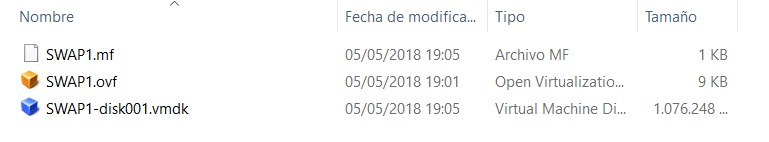
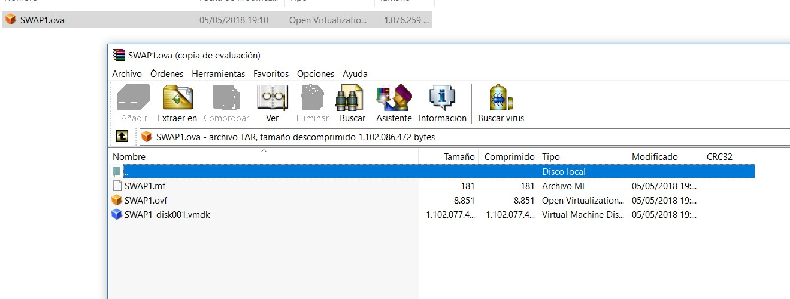
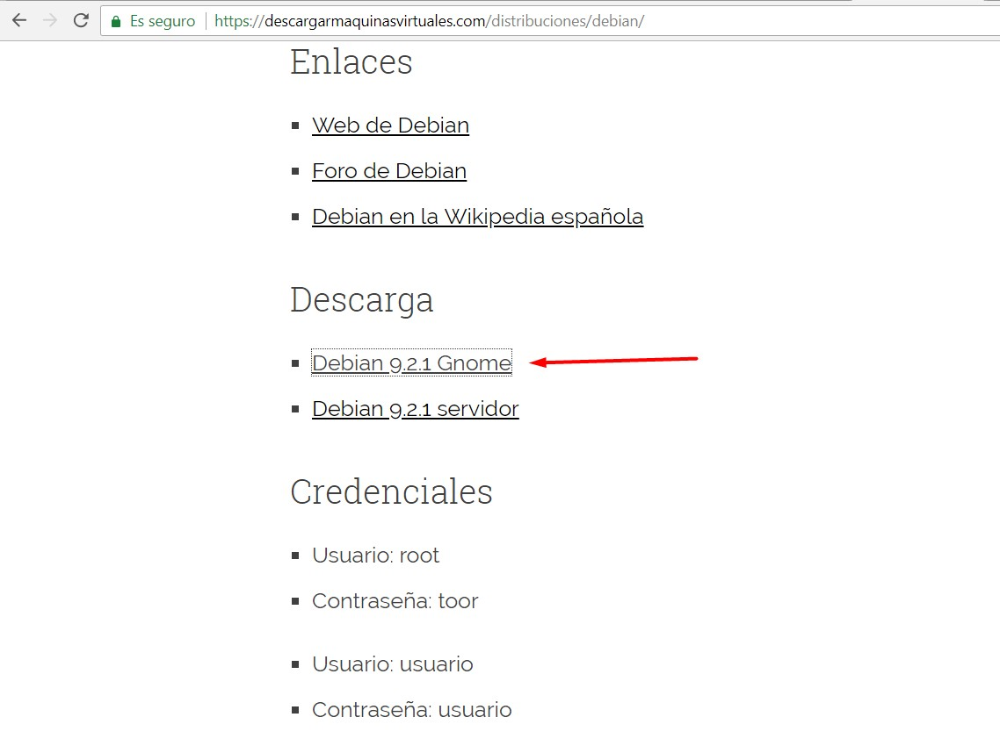
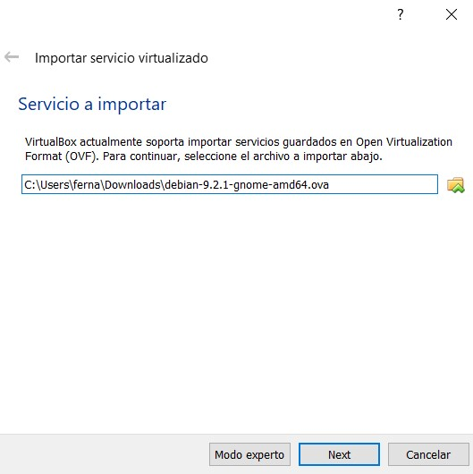
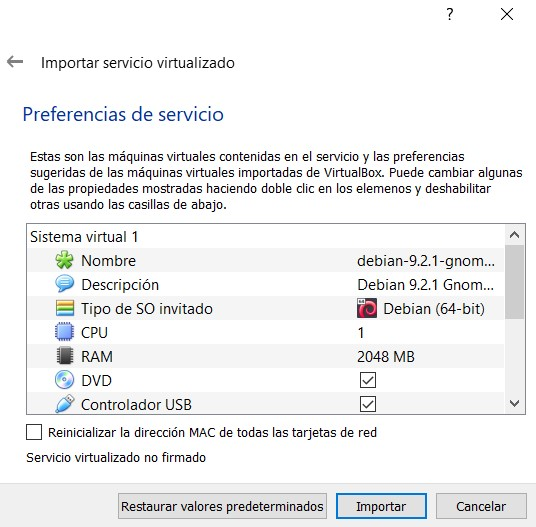
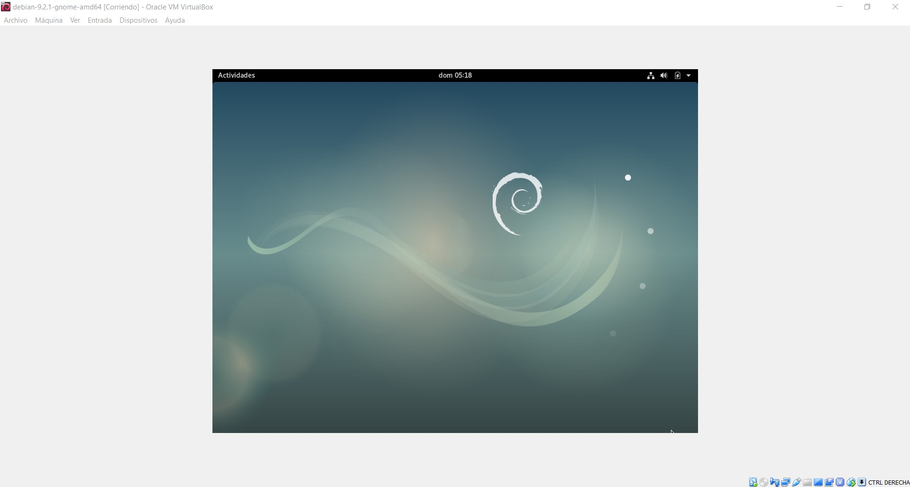
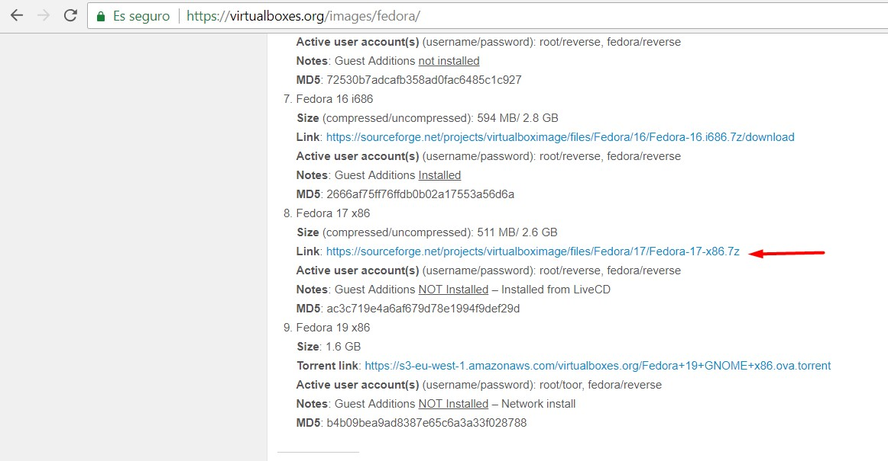
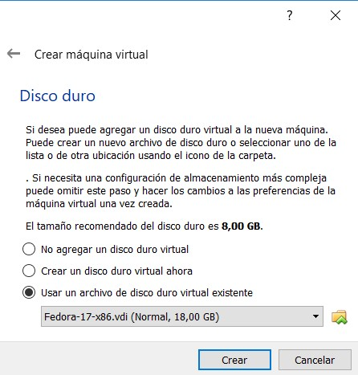
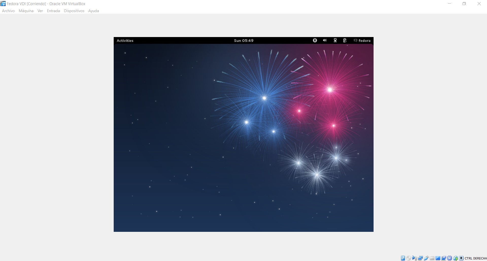

# Máquina virtual preparada para ponerla en cualquier hardware anfitrión
## 1. Introducción


El tema a tratar será, como se indica en el título, como una máquina virtual común puede "clonarse" en otra máquina anfitrión con un hardware distinto al hardware anfitrión de la máquina original. Open Virtualization Format (OVF) y Open Virtualization Appliance (OVA) son las dos presentaciones del estándar que nos permite importar máquinas virtuales alojadas en un determinado hardware anfitrión para transferir la información de dicha máquina virtual a otro hardware distinto, para exportar los archivos creados mediante el estándar (ya sean .ovf o .ova) en el nuevo hardware en el que queremos clonar la máquina virtual. Todo este proceso de clonado puede ser realizado con la ayuda de los medios software de virtualización, como pueden ser VirtualBox o VMware

## 2. ¿Qué es la DMTF?
Distributed Management Task Force (DMTF) es una organización dedicada al desarrollo de estándares para la gestión de sistemas en entornos de Tecnologías de la Información empresariales.. Buscando la construcción de componentes de infraestructura independientes de la plataforma, facilitando así a la interoperabilidad de sistemas de gestión entre productos de diferentes fabricantes o empresas.

Esta organización ha contado con la participación de empresas como AMD, Cisco,, HP, Huawei, IBM, Intel, Microsoft, Oracle, VMware, etc, llegando a tener en 2012 más de 4000 participantes activos dentro de las más de 200 organizaciones y empresas adscritos a la DMTF.

Uno de los estándares que esta organización ha promovido es el OVF, en el cual nos centraremos para el estudio del tema propuesto.

## 3. ¿Qué es OVF/OVA?
Como se ha comentado en la introducción, OVF y OVA son el estándar que nos permite importar máquinas virtuales de un hardware a otro. Este fue desarollado bajo el nombre de Open Virtual Machine Format en septiembre de 2007 por la DMTF

Su principal característica es que no está vinculado a ninguna arquitectura de procesador, lo que nos permite la importación de máquinas desde un hardware a otro sin importar las característica de dichos hardwares.

Su finalidad es la de describir un formato abierto, seguro, portable, eficiente y extensible para empaquetación y distribución de software a ejecutar en máquinas virtuales.

## 4. ¿Qué diferencias hay entre el formato OVF y el formato OVA?
Como ya se ha adelantado anteriormente en la introducción, ambos formatos son dos presentaciones de un mismo estándar realmente. 

La diferencia que existe entre estas dos es que en la presentación OVF, el empaquetado se presenta en distintos archivos, que normalmente son un archivo .ovf, que contiene la definición de la máquina virtual, uno o varios archivos .vmdk/.vhd/.vdi que son los ficheros correspondientes a los discos virtuales, y un archivo .mf (manifest file).



En cambio, en la presentación OVA, todo se empaqueta en un mismo archivo con extensión .ova, que, en resumen, empaqueta mediante TAR todos los archivos descritos en la presentación OVF en un solo archivo. Esto es una ventaja pues unifica dichos archivos en uno solo, lo cual hace más sencillo su manejo.



## 5. Ejemplos de software que implementan OVF




Entre los softwares de virtualización que implementan este estándar nos encontramos a dos archiconocidos, como lo son VirtualBox y VMware.

Virtualbox da soporte a OVF desde su versión 2.2.0, lanzada en abril de 2009, mientras que VMware hace lo propio desde Diciembre de 2007 en sus múltiples versiones.

## 6. ¿Qué es una Virtual Appliance?
Una Virtual Appliance (VA) es una máquina virtual preconfigurada y lista para ser utilizada en un hipervisor (medio software para poner en funcionamiento las máquinas virtuales). 

Por lo general, son máquinas configuradas con un determinado Sistema Operativo y con unas determinadas aplicaciones preinstaladas para cumplir con algún propósito específico. Son el mejor ejemplo de importación de máquinas virtuales preparadas para poder ser utilizadas y funcionar en cualquier tipo de hardware.

## 7.  Ejemplo de importación de Máquina Virtual en nuestro hardware anfitrión.
Nos dirigimos por ejemplo a la página descargarmaquinasvirtuales.com, que nos ofrece ya máquinas virtuales preconfiguradas.

Allí seleccionamos la distribución que deseemos y descargamos los archivos necesarios para la importación de la máquina virtual.



Una vez descargado el archivo .ova, procedemos a importarlo.





Como podremos observar en la siguiente imagen, la máquina virtual funciona con normalidad una vez iniciada:



## 8. Otra forma de exportar una máquina virtual
Hay otra forma de importar máquinas virtuales, importando el disco duro virtual de la máquina, la extensión de los archivos que guardan la información relativa a los discos duros virtuales suelen ser .vmdk/.vhd/.vdi,, como hemos visto, estos también se importan junto con los archivos .ovf y .mf cuando hacemos uso del estándar OVF.

La importación de únicamente el disco duro nos importará el software contenido en el mismo, pero no la configuración de la máquina virtual en cuestiones hardware específicas (como la RAM con la que haya sido configurada inicialmente, o las tarjetas de red necesarias para el correcto funcionamiento de la misma) dado que no se importan los datos asociados al archivo .ovf contenidos en una importación completa, aunque esto, en configuraciones sencillas no nos supondrá problema alguno.

## 8.1. Ejemplo de importación de disco duro virtual.
Nos dirigimos a una página web que nos aporte discos duros virtuales con distribuciones ya preinstaladas y descargamos un disco duro virtual:



Una vez descargado el archivo .ova, procedemos a crear una máquina virtual nueva e importamos el disco duro virtual descargado:



Como se puede ver en la siguiente captura, el software de la máquina ha sido importado y tal y como nos indicaba la página de descarga, el disco duro ya tiene instalada la distribución elegida:



## 9. Bibliografía
* https://en.wikipedia.org/wiki/Open_Virtualization_Format
* https://es.wikipedia.org/wiki/Distributed_Management_Task_Force
* https://thevirtualunknown.co.uk/2013/03/07/what-is-the-difference-between-ova-and-ovf/
* https://www.sysadmit.com/2013/12/vmware-formatos-ova-y-ovf.html
* https://en.wikipedia.org/wiki/Virtual_appliance
* https://www.redeszone.net/2017/11/11/descarga-maquinas-virtuales-sistema-linux-virtualbox-vmware-lista-funcionar/
* https://descargarmaquinasvirtuales.com/
* https://virtualboxes.org/images/
* http://drivemeca.blogspot.com.es/2013/03/importando-una-maquina-virtual-en.html








